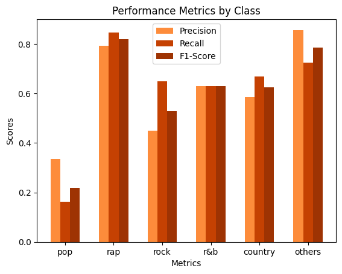
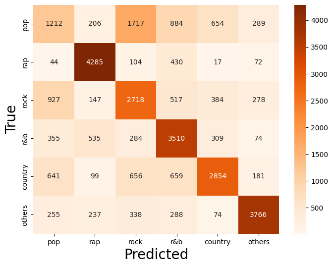

# Melody Meets Lyrics: A Neural Network Approach to Music Genre Classification

This repository contains the code for a music genre classification project focusing on accurately predicting the genre of songs based on their lyrical content. 

The achieved accuracy for six different classes is **61.5%**. To test the model, you can run the Jupyter Notebook `0_TRY_MODEL.ipynb`.

For more detailed information and insights, please refer to the full README file.

## Problem Statement 
**Can the genre of a song be accurately
predicted based solely on the analysis of its
lyrical content?**

## Method

The project leverages various techniques for data collection, preprocessing, feature engineering, and model development. The [dataset](https://www.kaggle.com/datasets/carlosgdcj/genius-song-lyrics-with-language-information) comprises song lyrics with corresponding genre labels obtained from Kaggle (~5m). 

The data preprocessing involves the removal of metadata, non-English songs, songs with limited lyrics, stopwords, and punctuation. 

Feature engineering involved the use of Google's Word2Vec, a widely recognized and powerful tool for word embedding, to create a mean vector for each song lyrics. Vector used as input of our model.

The model consists in a feed-forward neural network architecture (Input-500-250-Dropout-50-Output), with the hidden layers utilizing hyperbolic tangent (tanh) activation functions and the output layer a softmax activation function to predict the class probabilities for the multi-class classification task.

Different configurations and settings to optimize the neural network architecture where explored, ensuring the best possible performance given the complexity of the classification task. Multiple iterations and adjustments were made to fine-tune the model and improve its predictive capabilities, leading to the achieved accuracy of 61.5%.

## Results and Conclusion

The project achieved an overall accuracy of 61.5%, with precision scores ranging from 33.53% to 85.73% across different genres. 

**Performance Metrics**:

**Confusion Matrix**:

Despite the "acceptable" accuracy achieved, it is essential to acknowledge that the task of music genre classification is inherently complex and multifaceted. Music genres often involve intricate combinations of melody, rhythm, instruments used, and other factors beyond just the lyrical content. The achieved accuracy highlights the efficacy of the applied techniques within the constraints of analyzing song lyrics alone. However, it also underscores the inherent limitations of relying solely on textual data for genre classification, emphasizing the need for a more holistic approach encompassing a broader set of musical features.

## Files

- `0_TRY_MODEL.ipynb`: Notebook to try the model.
- `NN_model.ipynb`: A notebook to build and train the model.
- `data_retrieve_process.py`: This file reads the CSV file containing the lyrics data by chunks. The path to the CSV file should be `./Data/song_lyrics.csv`. For each row, the data is processed, and the processed data chunks are saved in the folders: `Data/InputData` and `Data/OutputData`.
- `load_input_output_Data.py`: This file loads all the input and output data chunks and saves them in the `Data/Vector` directory as a train/test/validation dataset (80/10/10). 

To try training and experimenting with the model, download the [dataset](https://www.kaggle.com/datasets/carlosgdcj/genius-song-lyrics-with-language-information) and place it into a folder called `Data`. After preprocessing the CSV file with `data_retrieve_process.py`, generate the training data with `load_input_output_Data.py`, and then use this data to train a model in `NN_model.ipynb`.

## License

This project is licensed under the MIT License - see the [LICENSE.md](LICENSE.md) file for details.
